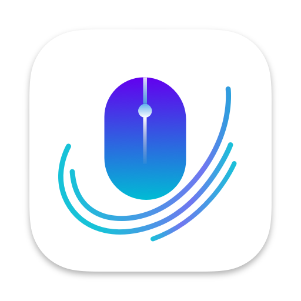
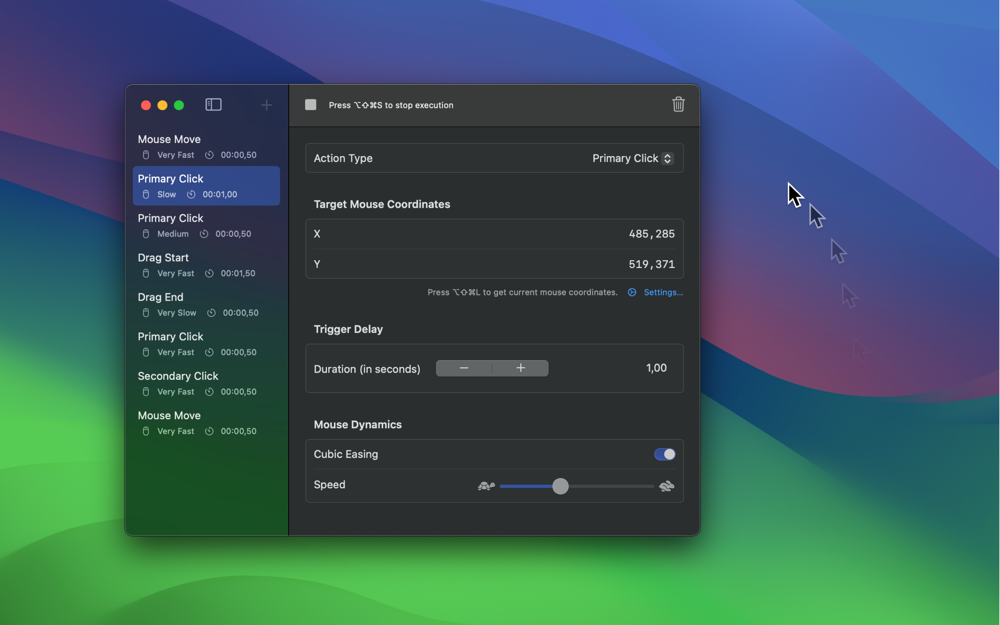

	
	 

# AutoMotion Studio 

AutoMotion Studio is a macOS application designed to automate mouse movements and clicks for professional and scripted video production. The app allows users to create a series of actions, including mouse movements, clicks, drags, and waits, and execute them in a specified order.

 <!-- Replace with the actual path to your icon -->

## Features

- [x] Mouse Movement: Move the mouse cursor to specified coordinates.
- [x] Mouse Click: Perform mouse clicks at specified coordinates.
- [x] Mouse Drag: Drag the mouse cursor to specified coordinates.
- [x] Wait Action: Delay the execution for a specified duration.

## Screenshots

## Contributing

Contributions are welcome! Please follow these steps to contribute:

- Fork the repository.
- Create a new branch (git checkout -b feature/your-feature-name).
- Commit your changes (git commit -m 'Add some feature').
- Push to the branch (git push origin feature/your-feature-name).
- Open a Pull Request.
